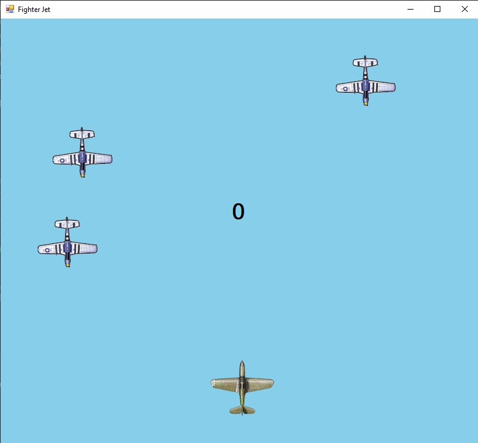
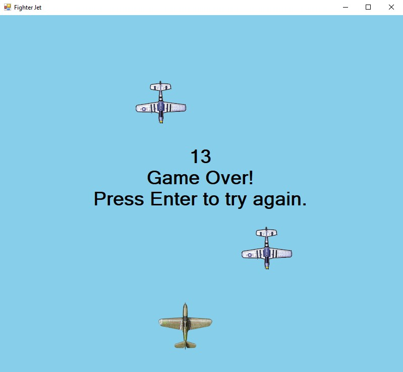
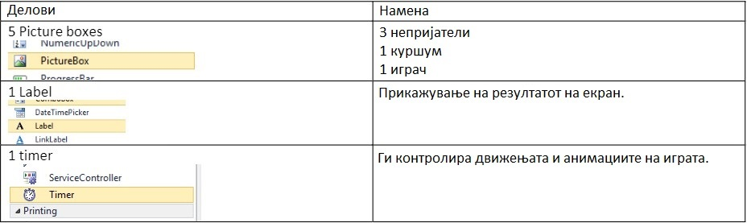
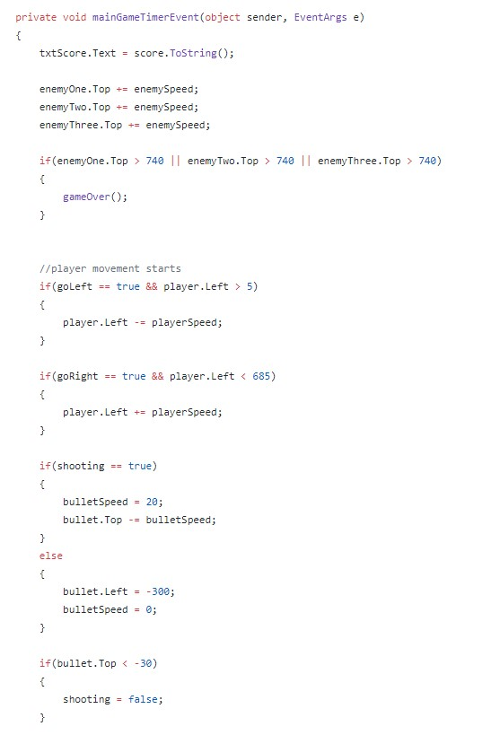
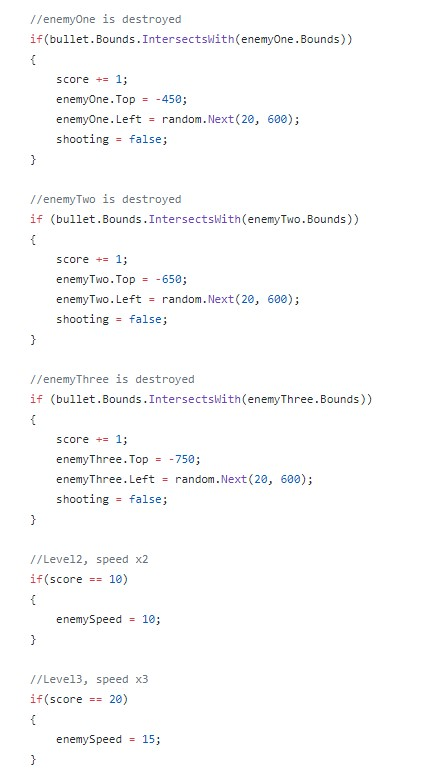

# FighterJet

**Fighter Jet** е едноставна "shooter" игра, составена од три непријателски авиони и еден авион кој го контролира играчот. 

**Целта на оваа игра** е играчот да ги пука и притоа уништи непријателските авиони кои доаѓаат од горниот дел на екранот, се додека истите не пристигнат до долниот дел на екранот каде што се наоѓа авионот со кој пука играчот.

 
 

**Упатсво за игра**
 
Авионот со кој пука играчот се движи само лево и десно, за што се користат левата и десна стрелка на тастатурата "Left and right arrows". Играчот пука кон непријателските авиони користејќи го копчето за празно место "Space" на тастатурата. Од горниот дел на екранот излегуваат три непријателски авиони, кои патуваат со одредена брзина. Играчот треба да ги погоди со куршум непријателските авиони при што истите се уништуваат. За секој уништен непријателски авион се зголемува резултатот за 1. 
Тежината на играта се зголемува откако играчот ке постигне резултат од 10 поени, при што непријателските авиони ја зголемуваат својата брзина за 2 пати. Играта влегува во крајното најтешко ниво откако ке биде постигнат резултат од 20 поени, при што авионите имаат брзина 3 пати поголема од почетната.
Играта завршува кога еден од непријателските авиони ќе пристигне до долниот дел на екранот, при што играчот губи (game over), се прикажува постигнатиот резултат и се појавува можност тој да почне нова игра со притискање на копчето "Enter" од тастатурата. 

 
 

**Имплементацијата** на играта се состои од 3 главни делови: Picture boxes, Label и Timer.

 
 

Целосната функционалност на играта е имплементирана во класата [Form1](https://github.com/bjanevski/FighterJet/blob/master/Fighter%20Jet/Form1.cs). Користени се коментари за објаснување на методите и нивните функционалности.
 

Во методот **mainGameTimerEvent()** се имплементирани движењата на играчот, уништувањето на противничките авиони како и менувањето на тежината на играта по одреден постигнат резултат. 
За започнување со движење на авионот на играчот, се прави проверка дали променливите goLeft и goRight се true, и притоа со проверката дали авионот е во соодветните координати на формата, се ограничува истиот да не излезе од сцената. Доколку овие услови се исполнети, играчот се придвижува со тоа што се додава/одзима брзината од променливата playerSpeed од picture box-от на авионот на играчот.  
За ударот на куршумот со непријателските авиони, се користи функционалноста bullet.Bounds.IntersectsWith(enemy.Bounds), при што се прави проверка дали границите на куршумот се пресекуваат со границите на некој непријателски авион. Доколку ова е точно, се зголемува резултатот за 1, се враќа уништениот непријателски авион надвор од сцената и се рандомизира локацијата на неговото следно појавување.
Тежината на играта се зголемува на тој начин што се прави едноставна проверка дали резултатот е 10, при што enemySpeed се зголемува на 10, а доколку резултатот изнесува 20, тогаш се зголемува на 15.

  
  G

 

